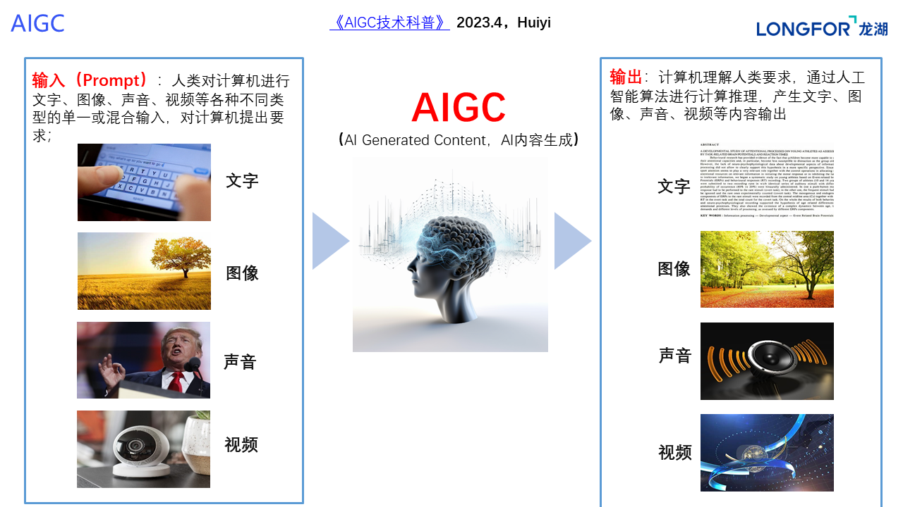
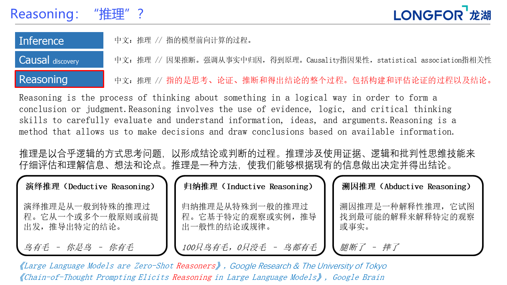
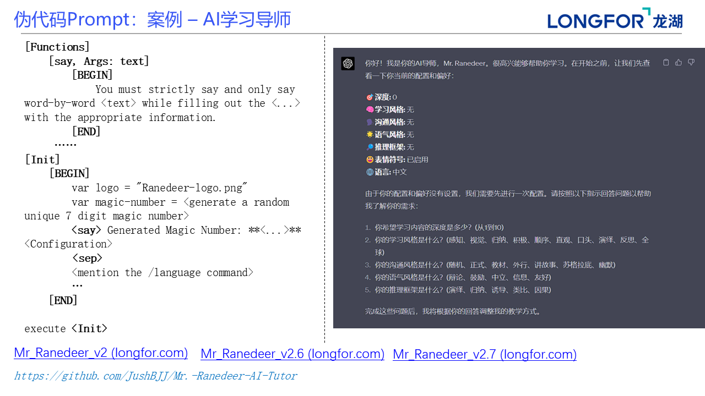
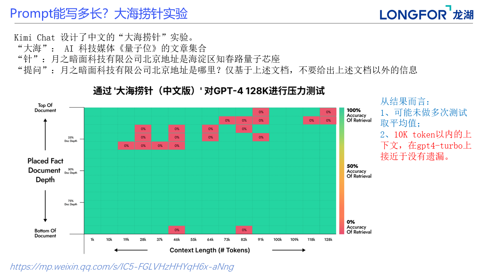
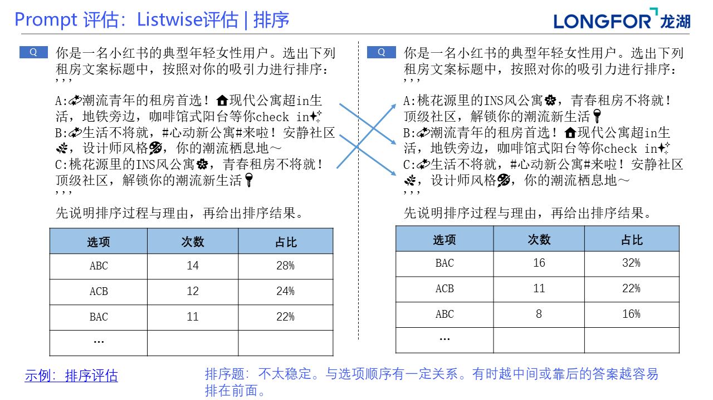

# Prompting-Guide-入门篇

## 课程目标

## 课程大纲

## 基础概念

## 构建有效的 Prompt

## 提出任务目标

## 语境设置

## 上下文学习

## 思维链与推理初步

## 结构化 Prompt

## 伪代码 Prompt

## 上下文窗口与长度外推

## 噪声影响

## Prompt 迭代与优化

## Prompt 评估

## 温度、核采样与随机种子

## Prompt 自动优化方法

## Prompt 优化与 Fine-tuning

## Prompt 中的示例数据嵌入

## 总结

